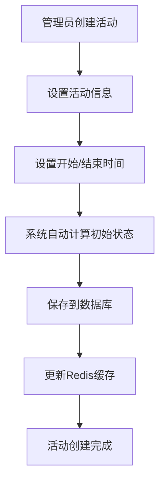
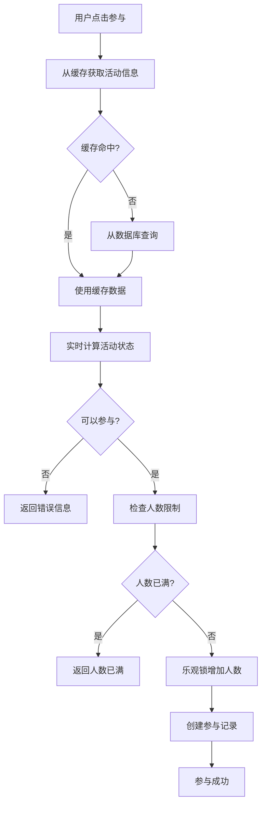
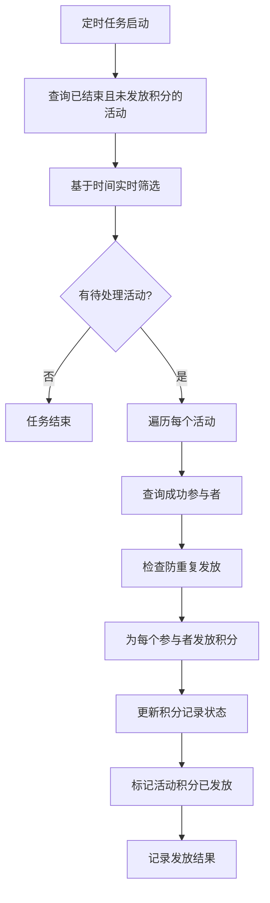
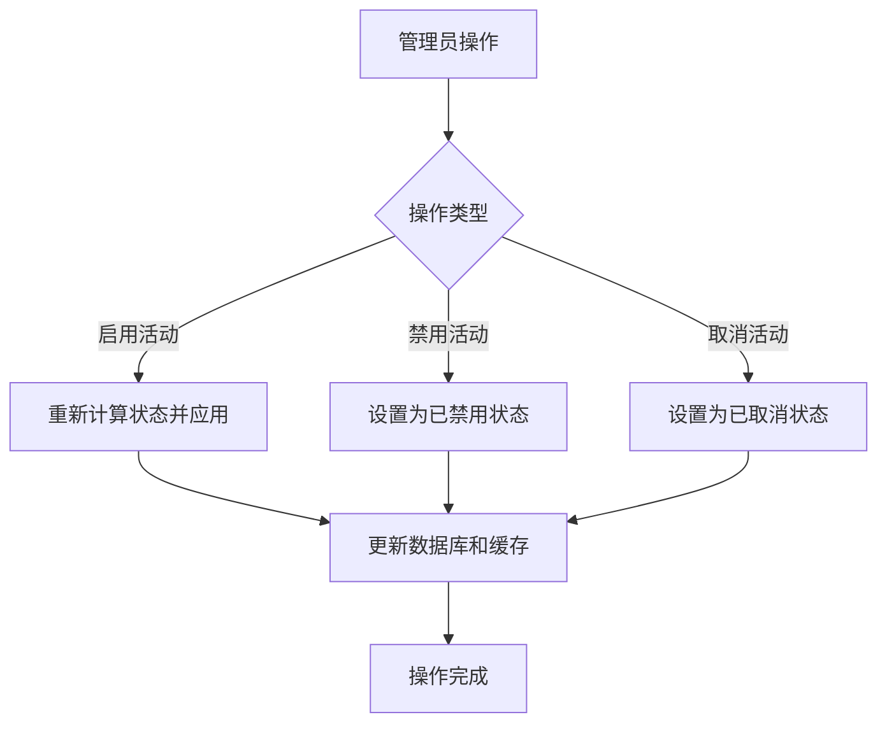
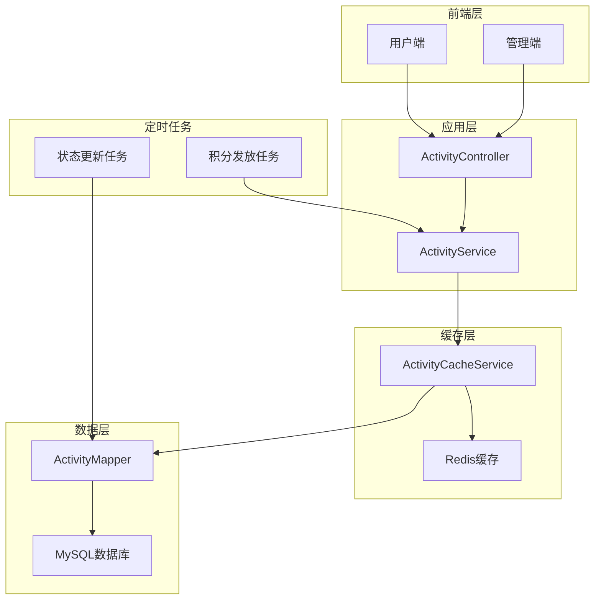

# 🎯 活动系统流程说明

## 📋 系统概述

本活动系统采用**实时状态计算**的设计理念，支持活动自动管理、用户参与、积分发放等功能。

### 🔄 核心设计理念

- **时间驱动**：活动状态完全根据设置的时间自动计算，无需手动干预
- **实时准确**：业务逻辑基于实时时间判断，零延迟
- **缓存优化**：Redis缓存提升查询性能，自动降级保证可用性
- **防重复机制**：多层保护避免重复操作

---

## 🎮 活动状态定义

### 状态枚举
```java
0: 待开始    - 当前时间 < 开始时间
1: 进行中    - 开始时间 ≤ 当前时间 < 结束时间  
2: 已结束    - 当前时间 ≥ 结束时间
3: 已取消    - 管理员永久取消，不可恢复
4: 已禁用    - 管理员暂时禁用，可重新启用
```

### 状态计算规则
- **自动状态（0、1、2）**：完全基于时间自动计算
- **管理员状态（3、4）**：手动设置，不会被自动改变
- **优先级**：管理员状态 > 时间计算状态

---

## 🚀 主要流程

### 1. 📝 活动创建流程



**关键特点**：
- ✅ 无需手动"发布"，根据时间自动生效
- ✅ 状态完全由设置的时间决定
- ✅ 立即生效，用户可实时看到

### 2. 🎯 用户参与流程



**实时判断逻辑**：
```java
// 直接基于时间判断，不依赖数据库status字段
Date now = new Date();
if (now.before(activity.getStartTime())) {
    return "活动尚未开始，还有 X 秒开始";
}
if (now.after(activity.getEndTime())) {
    return "活动已结束，无法参与";
}
```

### 3. 💰 积分发放流程



**查询SQL优化**：
```sql
-- 不依赖status字段，直接基于时间判断
WHERE is_deleted = 0 
  AND status NOT IN (3, 4)  -- 只排除管理员操作状态
  AND points_granted = 0 
  AND end_time < NOW()      -- 实时判断已结束
  AND points_amount > 0
```

### 4. 🔧 管理员控制流程



**操作接口**：
- `PUT /admin/activity/{id}/enable`  - 启用活动
- `PUT /admin/activity/{id}/disable` - 禁用活动  
- `PUT /admin/activity/{id}/cancel`  - 取消活动

---

## ⚡ 性能优化策略

### 1. Redis缓存层
```java
// 缓存策略
缓存时间：10分钟
缓存键：activity:{activityId}
降级策略：缓存失败自动降级到数据库查询
```

### 2. 数据库索引优化
```sql
-- 时间范围查询优化
CREATE INDEX idx_activity_time_query ON u_activity(
    is_deleted, status, start_time, end_time, 
    current_participants, max_participants
);
```

### 3. 定时任务优化
- **积分发放任务**：每5分钟执行
- **状态更新任务**：每30分钟执行（仅用于数据展示一致性）
- **批量处理限制**：单次最多处理50个活动

---

## 🛡️ 安全保障机制

### 1. 防重复参与
- 数据库唯一索引约束
- 业务逻辑双重检查
- 乐观锁控制并发

### 2. 防重复积分发放
- `points_granted`字段标记
- 积分记录表去重检查
- 批次号追踪机制

### 3. 容错处理
- Redis缓存自动降级
- 事务回滚保证数据一致性
- 详细日志记录便于排查

---

## 📊 系统架构图



---

## 🔄 部署升级步骤

### 1. 数据库升级
```bash
# 按顺序执行SQL脚本
mysql < sql/v2.4.1.sql  # 添加积分发放标记
mysql < sql/v2.4.2.sql  # 活动状态管理优化  
mysql < sql/v2.4.3.sql  # 实时状态判断优化
```

### 2. 应用部署
```bash
# 编译打包
mvn clean package -DskipTests

# 部署应用
java -jar xiaou-starter-xxx.jar

# 验证定时任务
curl -X POST /admin/activity/batch-update-status
curl -X POST /admin/activity/batch-grant-points
```

### 3. 功能验证
- ✅ 创建活动后状态自动计算
- ✅ 活动到时间立即可参与
- ✅ 积分自动发放
- ✅ 管理员控制功能正常

---

## 📈 监控指标

### 关键指标
- **活动参与成功率**：参与成功数 / 参与尝试数
- **积分发放成功率**：发放成功数 / 应发放数  
- **缓存命中率**：缓存命中数 / 总查询数
- **状态计算耗时**：平均状态计算时间

### 告警设置
- 积分发放失败率 > 5%
- 缓存命中率 < 80%
- 定时任务执行失败

---

## 🎉 总结

本活动系统通过**实时状态计算**的设计，实现了：

✅ **零延迟**：活动状态实时准确，无需等待定时任务  
✅ **高性能**：Redis缓存 + 数据库索引优化  
✅ **高可用**：多层容错机制保证系统稳定  
✅ **易维护**：逻辑简单直接，降低维护成本  
✅ **用户体验佳**：操作响应及时，状态显示准确

这套系统完美解决了传统活动系统中时间与状态不匹配的问题，为用户提供了流畅的活动参与体验。 